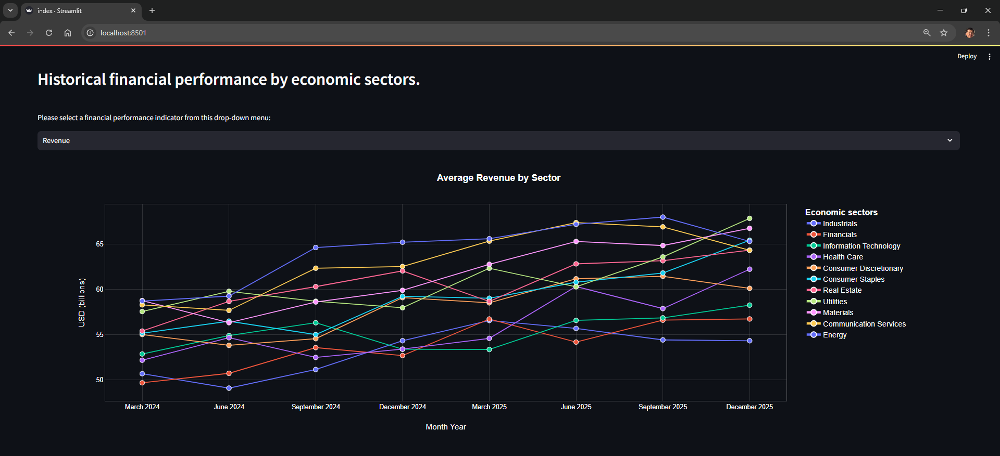
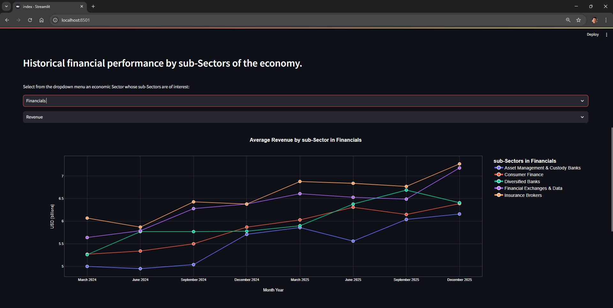
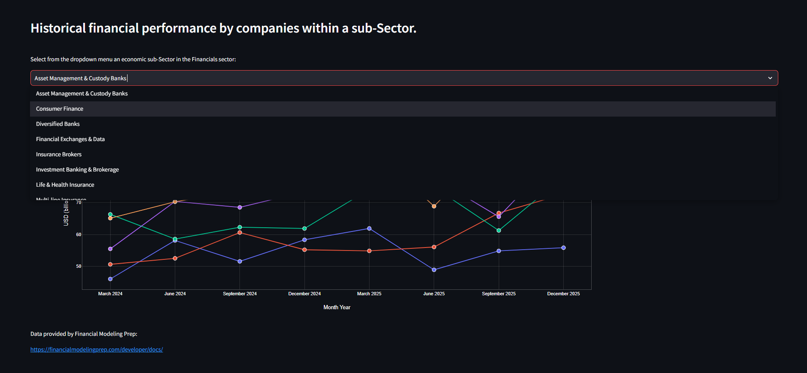
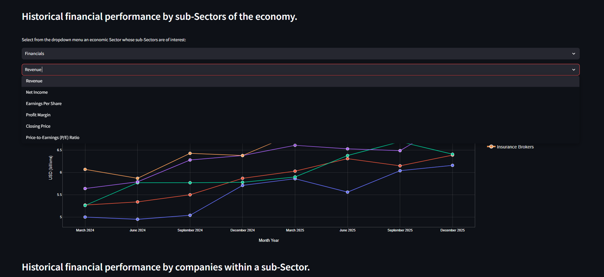
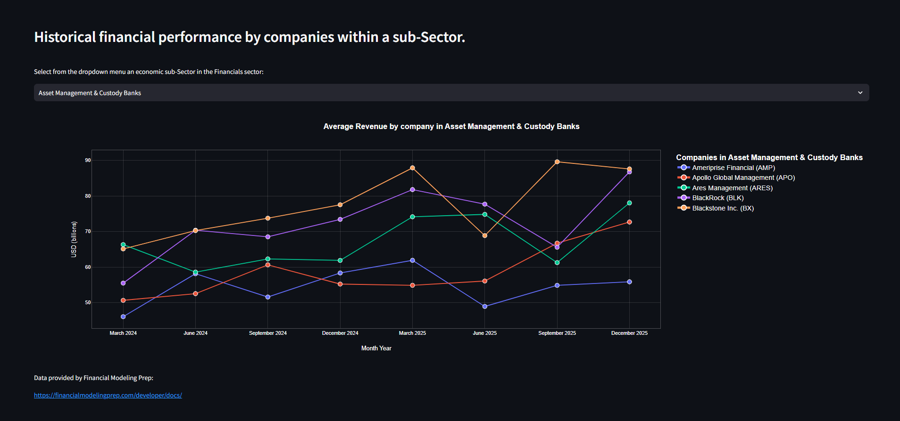
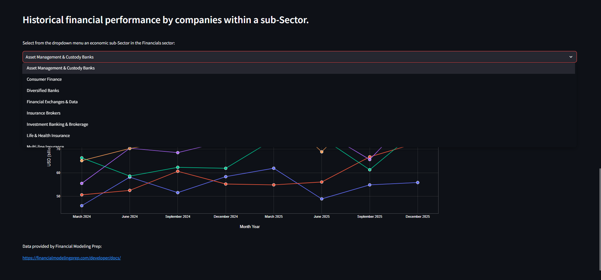

# Economic Industry Dashboard

The platform utilizes a **Heterogeneous Ingestion Engine** to dynamically parse index constituents and extract financial performance indicators—specifically Income Statement and Balance Sheet metrics—for the **S&P 500** across 11 Global Industry Classification Standard (GICS) Sectors and 165 Sub-Industries. Engineered for **temporal and cross-sectional analytical fidelity**, the system leverages a dedicated **PySpark** processing tier and an **Airflow workflow engine** to ensure 100% operational uptime while strictly adhering to a SEC data vendor's daily API quotas.

The backend architecture serves as a **production proof-of-concept for an Enterprise Flask Migration Toolkit**, decoupling legacy data structures from a high-performance, asynchronous **FastAPI** tier utilizing **Pydantic v2** validation. This design mirrors the **Provider/Core** architecture of the [OpenBB Platform](https://github.com/OpenBB-finance/OpenBB/tree/develop/openbb_platform)—an open-source infrastructure maintained by a **FINOS/Linux Foundation corporate member**. Patterns proven here were subsequently abstracted into a specialized toolkit, `flask_to_openbb_converter`, forming a high-impact [open-source contribution](https://github.com/OpenBB-finance/OpenBB/pull/7264) to the **[FINOS/Linux Foundation](https://www.finos.org/press/fintech-open-source-foundation-joins-linux-foundation-to-expand-and-accelerate-development-across-financial-services)** ecosystem.

GitHub: [github.com/BorisQuanLi/Economic_Industry_Dashboard](https://github.com/BorisQuanLi/Economic_Industry_Dashboard)

---

## Quick Start

```bash
# 1. Clone and enter the repository
git clone https://github.com/BorisQuanLi/Economic_Industry_Dashboard
cd Economic_Industry_Dashboard

# 2. Automate environment & dependency setup (Checks Python, creates .env, installs venv)
make setup

# 3. Build and launch the containerized stack (Postgres, FastAPI, ETL, Airflow, Streamlit)
docker compose up --build
```

## Dashboard & Services

Open `http://localhost:8501` — the Streamlit dashboard loads with representative S&P 500 data and is fully interactive without FMP API credentials.

> **On mock data:** The dashboard runs on representative mock data by design. The FMP API enforces a 250-call/day rate limit — exhausting it during a demo or CI run would be an unacceptable operational dependency. The Airflow DAG exists precisely to manage that quota in production: it batches extractions across days and writes results to PostgreSQL, at which point the mock layer is bypassed automatically. The mock values are scaled to realistic domain ranges (revenue ~$1B, closing price ~$150, EPS ~$5) so the visualization and aggregation logic is exercised faithfully. This pattern — a live data path and an offline-safe fallback — is standard practice in enterprise financial systems.

**Step 1 — Cross-Sector Historical Performance Analysis (Trailing 8 Quarters)** 
*Select a **GICS Sector** and analytical indicator to observe high-level temporal trends across the S&P 500 in the trailing 8 quarters.*



**Step 2 — Intra-Sector Sub-Industries Analysis**
*Drill into specific **Sub-Industry cohorts**—dynamically filtered via the **Parent GICS Sector** state propagated from Step 1—to identify analytical divergences and margin profiles across the trailing 8 quarters.*





**Step 3 — Intra-Sub-Industry Benchmarking (Trailing 8 Quarters)**
*Benchmarking individual company performance—this tier utilizes a **Cascading Analytical State**, inheriting both the normalized logical quarter and the financial indicator from Step 2. Pivoting the upstream indicator in the previous step automatically re-calibrates this benchmarking view across the shared trailing 8-quarter window.*





### Infrastructure Endpoints

- **Streamlit Dashboard:** `http://localhost:8501`
- **FastAPI Swagger UI:** `http://localhost:8000/docs`
- **Airflow UI:** `http://localhost:8080`
- **PostgreSQL:** `localhost:5432`

---

## Analytical Alignment: The Sliding Window Correction

Cross-sectional sector averages are frequently skewed by **Temporal Misalignment**. For example, while most S&P 500 peers report quarterly results in December, specific bellwethers (e.g., Apple) report in October. A naive temporal join conflates these disparate economic windows, resulting in significant analytical distortion.

This service implements a **Sliding Window Normalization** algorithm to partition and align these non-uniform reporting cadences into a synchronized logical quarter.

```bash
# Query the analytical alignment endpoint
curl http://localhost:8000/api/v1/analytics/sliding-window | python3 -m json.tool
```

**Curated System Response:**
```json
[
    {
        "aligned_quarter": "2025Q4_naive",
        "avg_revenue": 76580000000.0,
        "avg_eps": 3.42,
        "companies_count": 5,
        "filing_alignment": "unaligned — Apple Oct 2025 mixed with peers Dec 2025"
    },
    {
        "aligned_quarter": "2025Q4_aligned",
        "avg_revenue": 75640000000.0,
        "avg_eps": 3.38,
        "companies_count": 5,
        "filing_alignment": "sliding_window_applied — Apple Oct 2025 shifted +1 quarter"
    }
]
```

**Interpretation of Results:**
The API exposes the delta between naive and aligned analytical views:
- **`{year}Q4_naive`**: Apple's October results are mixed with its peers' December results. This typically **inflates avg_revenue** by mixing disparate economic periods.
- **``{year}Q4_aligned`**: The sliding window correction. Apple's data is shifted +1 quarter to align with the same calendar period as its peers, ensuring **cross-sector fidelity**.

The `avg_revenue` delta between these rows quantifies the "reporting lag error"—which in this dataset produces a **~$4.7B cumulative sector distortion** and a ~$0.94B skew in average revenue across the Information Technology cohort.

---

## What this project demonstrates

The codebase reflects a realistic engineering progression: a working Flask/PostgreSQL backend refactored into a modular FastAPI service, an Airflow-orchestrated ETL pipeline extended with PySpark distributed analytics, and an MCP-based AI agent layer added on top of the existing data infrastructure — each stage building on the last without discarding what worked.

**Services in this repo:**

| Directory | Role |
|---|---|
| `flask_backend/` | Original REST API — Blueprint architecture, MVC pattern, PostgreSQL via SQLAlchemy |
| `fastapi_backend/` | Async API layer — versioned routing, Pydantic v2 models, DI via `Depends()`, Redis cache-aside |
| `etl_service/` | PySpark ETL pipeline — Wikipedia ingestion, JDBC reads from PostgreSQL, window function analytics |
| `airflow/` | Orchestration — DAGs for rate-limited FMP API extraction (250 calls/day), data quality checks |
| `mcp_agent_system/` | AI agent layer — MCP server exposing financial tools; LangGraph stateful agent with FAISS RAG |
| `frontend/` | Streamlit dashboard — sector/sub-sector/company-level financial performance visualization |

---

## Architecture

```text
       FMP Rate-Limited API (Inbound Ingestion)
                  │
                  ▼
         Apache Airflow DAGs (Workflow Orchestration)
                  │
                  ▼
         PostgreSQL (Persistent Storage Layer)
          ┌───────┴───────┐
          │               │
   PySpark Tier       FastAPI Serving Tier
(Window Analytics,    (Async, Redis Caching,
 Broadcast Joins)      Adapter Patterns)
          │               │
          └───────┬───────┘
                  ▼
         MCP Agent Layer (Stateful Reasoning)
                  │
                  ▼
         Streamlit (Presentation Tier)
```

---

## Key technical decisions

**FastAPI service layer (`fastapi_backend/`)**

- Versioned REST API (`/api/v1/`) with dedicated routers per resource domain (`sectors`, `analytics`)
- All route handlers are `async def`; database sessions injected via `Depends(get_db_session)`
- `SlidingWindowService` encapsulates cross-sector temporal alignment as an independently testable service class — decoupled from the router layer
- Pydantic v2 response models (`CompanyFinancials`, `SlidingWindowAnalytics`) enforce contract-first API design
- Redis cache-aside on sector aggregation endpoints (`cache.py`) — TTL-based invalidation, cache miss falls through to PostgreSQL

**PySpark ETL pipeline (`etl_service/`)**

Two-stage pipeline, decoupled by design:

- Stage 1 (always runs): Wikipedia S&P 500 CSV → `SparkCompaniesBuilder` → sector risk ranking, employee-delta velocity via lag window functions
- Stage 2 (runs when DB is populated): PostgreSQL → `SparkFinancialsReader` (JDBC) → rolling 2-year P/E window by sub-industry via `Window.partitionBy().orderBy().rowsBetween()`, sub-sector risk enrichment via broadcast join

Stage 2 skips gracefully if the upstream Airflow pipeline hasn't populated the DB yet.

**AI agent layer (`mcp_agent_system/`)**

- MCP server (`server.py`) exposes financial data tools callable by any MCP-compatible client
- LangGraph `StateGraph` with `AMLAgentState` TypedDict: `ingest → retrieve → reason → escalate | respond`
- Conditional edge routes high-risk sectors to an escalation node — models regulated-environment branching that a linear LLM chain cannot express
- FAISS vector index built from `SparkCompaniesBuilder.get_sector_summary()` output; retriever injected at graph construction time for testability
- LLM injected as a dependency — mocked in all tests, no live API calls required

**Infrastructure**

- Multi-service Docker Compose stack — drop-in ECS deployment path
- Root-level `Makefile` with `make init`, `make test`, `make lint` targets abstracting Docker Compose and per-service pytest runs
- GitHub Actions CI/CD: multi-service test matrix, zero-lint baseline via ruff scoped per service layer
- Kubernetes manifests in `k8s/` for production deployment
- AWS service modules in `etl_service/aws/` for Glue/S3/RDS integration

---

## Technology stack

**Backend**
- Python 3.12+
- FastAPI 0.104.1 — async endpoints, Pydantic v2, `Depends()` DI
- Flask 1.1.2 — Blueprint architecture, SQLAlchemy ORM
- Redis — cache-aside on aggregation endpoints
- PostgreSQL 13 — primary data store

**Data pipeline**
- Apache PySpark 3.5.0 — window functions, broadcast joins, JDBC reads
- Apache Airflow — DAG orchestration, rate-limited API extraction
- Financial Modeling Prep (FMP) API — S&P 500 financial statements

**AI / agent layer**
- LangGraph — stateful `StateGraph` with conditional routing
- FAISS — vector index for RAG retrieval
- LangChain / ChatOpenAI — LLM integration (injected, not hardcoded)
- Model Model Context Protocol (MCP) — tool-serving layer for agent integration

**Infrastructure**
- Docker + Docker Compose
- Kubernetes v1.20.2
- GitHub Actions (CI/CD)
- AWS: Glue, S3, RDS, ECS, Redshift (migration path)

**Frontend**
- Streamlit — sector/sub-sector/company financial performance dashboard

---

## Local development (per-service venv)

Each service has its own `requirements.txt` and is designed to run in an isolated virtual environment. Alternatively, `make setup` installs all dependencies into a root-level `.venv`.

**FastAPI backend**
```bash
cd fastapi_backend/
python3 -m venv venv && source venv/bin/activate
pip install -r requirements.txt
uvicorn main:app --reload
# http://localhost:8000/docs
```

**Flask backend**
```bash
cd flask_backend/
python3 -m venv venv && source venv/bin/activate
pip install -r requirements.txt
python3 run.py
# http://localhost:5000/
```

**ETL service (PySpark)**
```bash
cd etl_service/
python3 -m venv venv && source venv/bin/activate
pip install -r requirements.txt
python3 pipelines/standard_pipeline.py --companies-only
```

**Streamlit frontend**
```bash
cd frontend/
python3 -m venv venv && source venv/bin/activate
pip install -r requirements.txt
streamlit run src/index.py
```

**MCP agent system**
```bash
cd mcp_agent_system/
python3 -m venv venv && source venv/bin/activate
pip install -r requirements.txt
python3 run_demo.py
```

**Airflow Orchestration**
Local development is fully managed via the containerized stack established in **Quick Start**. To trigger the data-extraction pipeline manually for analytical verification:
```bash
docker compose exec airflow-webserver airflow dags trigger disparate_filing_dates_extraction
```
